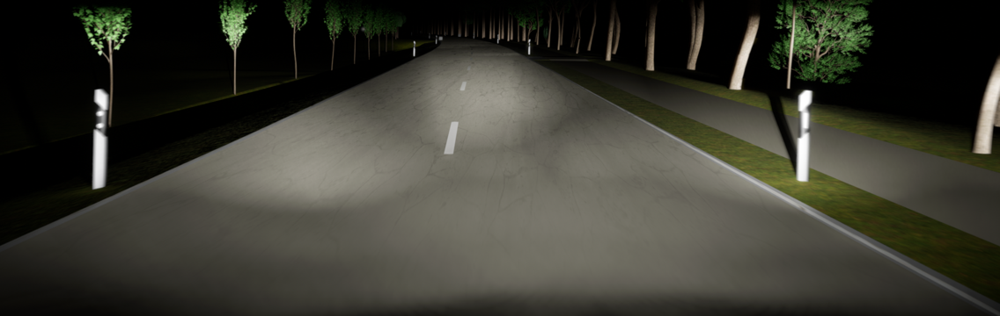
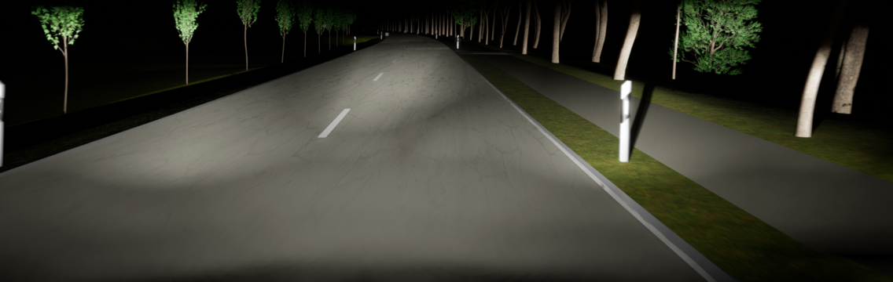
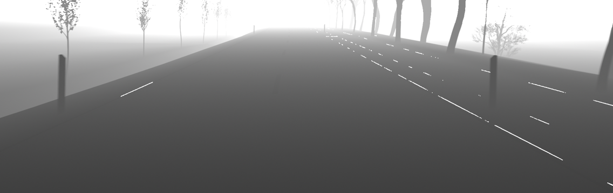
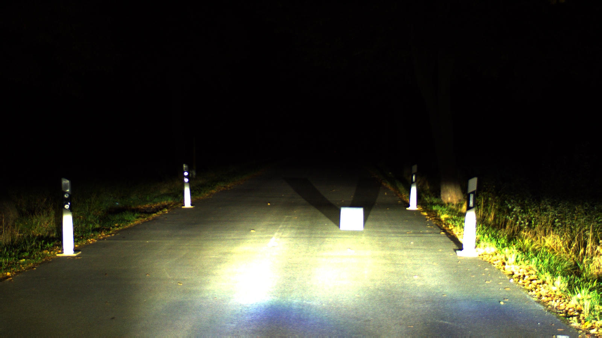
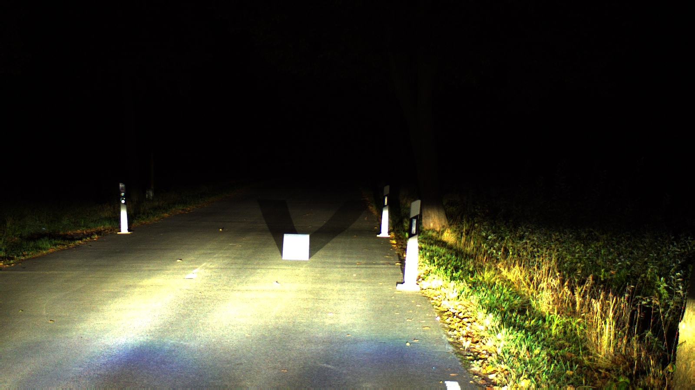
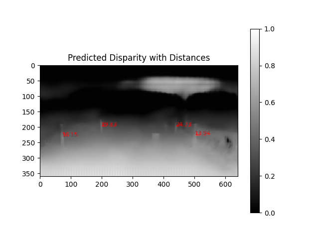

# Deep-Stereo-Vision-for-Nighttime-Driving-Scenes
Deep Stereo Vision for nighttime driving scenes

## 1. UE Stereo Image Pair
**Left Image:**

**Right Image:**

## 2. Disparity Map
The computed disparity map:

## 3. Real Data
Generated point cloud visualizations:

**Left:**

**Right:**

**Predicted Disparity:**

